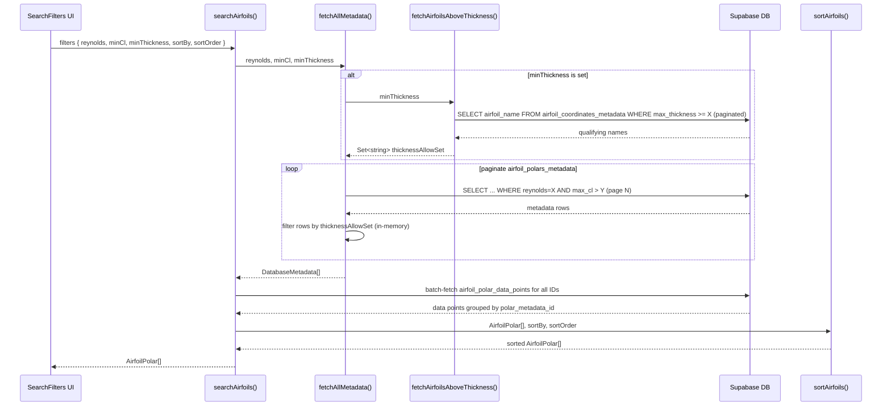

# Airfoil Search Filter — Detailed Explanation

## Overview

The filter system lets users narrow down an airfoil database to only the polars that meet their aerodynamic requirements, then sort the surviving results by a performance metric. The pipeline has three phases:

```
User fills in SearchFilters UI
        ↓
searchAirfoils(filters) is called
        ↓
Phase 1 – Fetch matching metadata (Reynolds + minCl applied in SQL; thickness applied in memory)
        ↓
Phase 2 – Batch-fetch all data points for surviving polars
        ↓
Phase 3 – Sort / rank the assembled polars
        ↓
Return AirfoilPolar[] to the UI
```

---

## The [SearchFilters](file:///Users/jialielu/highschoolproj/airfoil2/components/SearchFilters.tsx#13-183) Type

```ts
interface SearchFilters {
  reynolds:     number | null;          // exact Reynolds number match
  minCl:        number | null;          // minimum peak lift coefficient
  minThickness: number | null;          // minimum max-thickness (fraction of chord)
  sortBy:       'cl' | 'cd' | 'clcd' | null;
  sortOrder:    'asc' | 'desc';
}
```

All four filtering/sorting fields are **optional** (`null` = "don't apply this filter").

---

## Filter 1 — Reynolds Number (`reynolds`)

### What it filters
The Reynolds number (Re) describes the airflow condition. Each polar in the database was computed at a specific Re. This filter selects **only polars computed at exactly that Re**.

### Where it applies
Inside [fetchAllMetadata](file:///Users/jialielu/highschoolproj/airfoil2/services/airfoilService.ts#163-225), a Supabase `.eq()` constraint is appended to the query **only when `reynolds !== null`**:

```ts
if (reynolds !== null) {
  query = query.eq('reynolds', reynolds);
}
```

The SQL equivalent is:
```sql
WHERE reynolds = <value>
```

### UI behaviour
The [SearchFilters](file:///Users/jialielu/highschoolproj/airfoil2/components/SearchFilters.tsx#13-183) component shows five preset buttons:

| Button label | Value sent |
|---|---|
| 50k | 50,000 |
| 100k | 100,000 |
| 200k | 200,000 |
| 500k | 500,000 |
| 1M | 1,000,000 |

Clicking a selected button **deselects** it (toggles back to `null`), so the user can also search across all Re values.

```ts
const handleReynoldsSelect = (value: number) => {
  setFilters(prev => ({
    ...prev,
    reynolds: prev.reynolds === value ? null : value  // toggle
  }));
};
```

### Example
> User clicks **100k**.
> Only polars where `reynolds = 100000` are returned from `airfoil_polars_metadata`.
> A NACA 4412 polar computed at Re = 500,000 is excluded.

---

## Filter 2 — Minimum Cl Threshold (`minCl`)

### What it filters
`minCl` sets a **floor on the airfoil's peak lift coefficient**. Any airfoil whose maximum achievable Cl (across all angles of attack in that polar) does not exceed the threshold is excluded.

### Where it applies
`airfoil_polars_metadata` stores a pre-computed `max_cl` column for each polar. The SQL filter uses `.gt()` (strict greater-than):

```ts
if (minCl !== null) {
  query = query.gt('max_cl', minCl);
}
```

SQL equivalent:
```sql
WHERE max_cl > <minCl>
```

> [!NOTE]
> This is a **strict** greater-than, not ≥. Setting `minCl = 1.5` excludes an airfoil with `max_cl = 1.5` exactly.

### Example
> User types `1.5` into "Minimum Cl Threshold".
> The database only returns polars whose `max_cl > 1.5`.
> A thin symmetric airfoil that peaks at Cl = 1.3 is excluded.
> A cambered airfoil reaching Cl = 1.8 passes through.

---

## Filter 3 — Minimum Max Thickness (`minThickness`)

### What it filters
This filter excludes airfoils that are too thin structurally. The value is expressed as a **fraction of chord length** (e.g., `0.12` = 12% chord thickness).

### Why it's more complex
Thickness data lives in a **separate table** (`airfoil_coordinates_metadata`, not `airfoil_polars_metadata`). Supabase cannot easily join across these in the simple `.from()` query, so the filter is applied in **two sub-steps**:

#### Sub-step A — Pre-resolve which airfoil names qualify

```ts
async function fetchAirfoilsAboveThickness(minThickness: number): Promise<Set<string>> {
  // Queries airfoil_coordinates_metadata with pagination
  // SQL: SELECT airfoil_name FROM airfoil_coordinates_metadata WHERE max_thickness >= minThickness
  // Returns a Set<string> of qualifying airfoil names (lowercased)
}
```

> [!NOTE]
> This uses **`gte` (≥)**, unlike the Cl filter. Setting `minThickness = 0.12` includes airfoils with exactly 12%.

#### Sub-step B — In-memory filtering of polar metadata

After `airfoil_polars_metadata` rows are fetched from the database, each page of results is filtered client-side:

```ts
const page = (data as DatabaseMetadata[]).filter(m =>
  thicknessAllowSet === null || thicknessAllowSet.has(m.airfoil_name.toLowerCase())
);
```

This checks whether the polar's `airfoil_name` appears in the pre-resolved allow-set.

#### Pagination for thickness lookup
Because `airfoil_coordinates_metadata` may have thousands of rows, the allow-set is built with a `while` loop in pages of 1 000:

```ts
while (hasMore) {
  const { data } = await supabase
    .from('airfoil_coordinates_metadata')
    .select('airfoil_name')
    .gte('max_thickness', minThickness)
    .range(offset, offset + pageSize - 1);

  // add names to Set, advance offset ...
}
```

### Example
> User types `0.12` into "Minimum Max Thickness".
>
> Sub-step A fetches: `{ "naca2412", "naca4415", "clark-y", … }` (lowercase names).
>
> Sub-step B: after fetching polar metadata, each row is checked:
> - `naca2412` → in the set → **kept**
> - `naca0006` (6% thick) → not in the set → **dropped**

---

## How the Three Database Filters Combine

When all three filters are active, they narrow the candidate set in sequence:

```
All polars in DB
  → [Reynolds exact match — SQL]
  → [max_cl > minCl — SQL]
  → [airfoil_name in thicknessAllowSet — in-memory]
  = Surviving polars
```

Because the Reynolds and Cl filters run in SQL, only the thickness cross-check adds a client-side pass. The pagination loop in [fetchAllMetadata](file:///Users/jialielu/highschoolproj/airfoil2/services/airfoilService.ts#163-225) ensures the full table is scanned even when results exceed 1 000 rows.

### Full combined example
> Filters: `reynolds = 200000`, `minCl = 1.2`, `minThickness = 0.10`
>
> 1. SQL query returns all polars at Re = 200k with `max_cl > 1.2`
> 2. Suppose 340 rows come back across pages
> 3. Of those, only rows whose `airfoil_name` is in the thickness allow-set (airfoils ≥ 10% thick) survive — say 180 rows
> 4. Those 180 metadata records are returned to [searchAirfoils](file:///Users/jialielu/highschoolproj/airfoil2/services/airfoilService.ts#269-302)

---

## Phase 2 — Batch Data-Point Fetch

Once the surviving metadata IDs are known, their full polar curves are fetched efficiently in batches of 10 (Supabase's practical `.in()` limit):

```ts
for (let i = 0; i < polarMetadataIds.length; i += batchSize) {
  const batch = polarMetadataIds.slice(i, i + batchSize);
  const { data } = await supabase
    .from('airfoil_polar_data_points')
    .select('polar_metadata_id, alpha, cl, cd, cdp, cm, top_xtr, bot_xtr, clcd')
    .in('polar_metadata_id', batch)
    .order('alpha', { ascending: true });
  // ...
}
```

Results are grouped into a `Map<polarId, DataPoint[]>` for O(1) lookup when assembling the final [AirfoilPolar](file:///Users/jialielu/highschoolproj/airfoil2/types.ts#13-24) objects.

> [!NOTE]
> Polars with **zero data points** are silently skipped — this guards against corrupt or incomplete database entries.

---

## Phase 3 — Sort / Rank (`sortBy` + `sortOrder`)

After conversion to `AirfoilPolar[]`, results are sorted purely **client-side** using the full [data](file:///Users/jialielu/highschoolproj/airfoil2/services/airfoilService.ts#163-225) arrays:

| `sortBy` | Metric computed | Meaning |
|---|---|---|
| `'cl'` | `Math.max(...data.map(d => d.cl))` | Peak lift coefficient across all α |
| `'cd'` | `Math.min(...data.map(d => d.cd))` | Minimum drag coefficient |
| `'clcd'` | `Math.max(...data.map(d => d.clcd))` | Peak lift-to-drag (L/D) ratio |
| `null` | — | No sorting; order follows database insertion order |

The `sortOrder` then reverses the result if `'asc'` is chosen:

```ts
if (sortOrder === 'asc') {
  return valueA - valueB;   // smallest first
} else {
  return valueB - valueA;   // largest first (default)
}
```

### Sort examples

**Example A — Sort by Max Cl, Descending**
> Airfoils with the highest peak Cl appear first.
> A cambered NACA 4415 reaching Cl = 2.1 ranks above a symmetric NACA 0012 at Cl = 1.5.

**Example B — Sort by Min Cd, Ascending**
> Airfoils with the **lowest** minimum drag coefficient appear first.
> `sortOrder = 'asc'` is appropriate here (lower is better for drag).

**Example C — Sort by Max L/D, Descending**
> Airfoils with the best aerodynamic efficiency (highest Cl/Cd) appear first.
> This is the most common criterion for cruise performance selection.

---

## Reset / "Clear Deck"

The **Clear Deck** button resets all filters to their defaults:

```ts
const handleReset = () => {
  setFilters({
    reynolds: null,
    minCl: null,
    minThickness: null,
    sortBy: null,
    sortOrder: 'desc'
  });
};
```

With all values `null`, [searchAirfoils](file:///Users/jialielu/highschoolproj/airfoil2/services/airfoilService.ts#269-302) returns **every polar** in the database (up to pagination limits), unsorted.

---

## Data Flow Diagram



---

## Summary Table

| Filter | Field | Where applied | Operator | Data source |
|---|---|---|---|---|
| Reynolds number | `reynolds` | SQL (`.eq`) | = (exact) | `airfoil_polars_metadata.reynolds` |
| Minimum peak Cl | `minCl` | SQL (`.gt`) | > (strict) | `airfoil_polars_metadata.max_cl` |
| Minimum thickness | `minThickness` | SQL pre-fetch + in-memory | ≥ (inclusive) | `airfoil_coordinates_metadata.max_thickness` |
| Sort metric | `sortBy` | Client-side JS | — | Full `data[]` arrays scanned |
| Sort direction | `sortOrder` | Client-side JS | — | Applied to sorted values |
